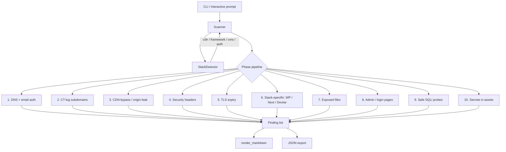

# LucidScanner

A multi-stack web security audit tool. It fingerprints the target's stack
(WordPress, Next.js/Vercel, Astro, Rails/Devise, …) and runs the checks that
actually apply to it, then writes a prioritized Markdown report with evidence,
impact, and a concrete fix for every finding.

> ⚠️ **Authorized use only.** Run this against infrastructure you own or have
> explicit written permission to test. Every request is tagged with an
> identifiable audit signature (see [Audit signature](#audit-signature)) so the
> owner can confirm a scan in their logs. Unauthorized scanning may violate the
> CFAA, the UK Computer Misuse Act, or equivalent laws in your jurisdiction.

## Why this exists

Generic scanners spray every check at every target. LucidScanner detects the
stack first and only runs relevant probes — a WordPress site gets user-enum and
xmlrpc checks, a Next.js/Vercel site gets env-leak and source-map checks, a
Rails/Devise site gets sign-up/registerable checks. Findings come back with a
remediation that names the actual config knob to turn, not generic advice.

## What it checks

| Phase | Check |
|------:|-------|
| 1  | DNS records (A/MX/TXT), SPF, DMARC posture |
| 2  | CT-log subdomain enumeration (crt.sh → HackerTarget fallback) |
| 3  | Subdomains that bypass the CDN and expose the origin directly |
| 4  | HTTP security headers (HSTS, CSP, X-Content-Type-Options, Referrer-Policy, `X-Powered-By` leak) |
| 5  | TLS certificate expiry |
| 6  | Stack-specific — WordPress (user enum, `?author` leak, xmlrpc, password-reset oracle), Next.js/Vercel (env/source-map leaks, security checkpoint), Devise (open sign-up, login exposure) |
| 7  | Exposed config / backup files (`.env`, `wp-config.php.bak`, `.git/config`, DB dumps, …) |
| 8  | Reachable admin / login pages |
| 9  | Error-based SQL injection probes (non-destructive — no `DROP`/`UPDATE`/`DELETE`) |
| 10 | Leaked credentials in client JS/HTML (Stripe, AWS, Google, GitHub, Slack tokens, private keys) |
| 11 | Supabase/PostgREST backend — anon key extracted from client JS, then tables probed for missing/permissive Row-Level Security (counts only, never pulls row data) |

## Install

```bash
pip install -r requirements.txt
```

Requires Python 3.9+. `dnspython` is optional — without it, phases 1–3 degrade
gracefully and the rest still run.

## Usage

```bash
# interactive — prompts for the URL
python lucid_scanner.py

# direct
python lucid_scanner.py https://example.com

# quiet, and also emit machine-readable JSON
python lucid_scanner.py https://example.com -q --json findings.json

# use a browser User-Agent (some WAFs challenge non-browser UAs)
python lucid_scanner.py https://example.com --browser-ua
```

By default it writes `report_<host>_<timestamp>.md` and prints a greppable
one-line summary to stdout:

```
example.com | critical:0 high:1 medium:3 low:2 info:2
```

Each finding carries a **severity**, the **evidence** that triggered it, the
**impact**, and a specific **fix**.

## Architecture



The design is deliberately small and testable:

- **`StackDetector`** classifies the target from one homepage fetch into
  `cdn / app_framework / cms / auth / hosting` buckets. Stack-specific phases
  ask it `is_wp()`, `is_next()`, `is_devise()` and skip themselves otherwise.
- **`Scanner`** owns the HTTP session and runs each phase in isolation — a phase
  that throws is logged and skipped, so one failure never aborts the audit.
- **`Finding`** is a plain value object; **`render_markdown`** turns a list of
  them into the report. Both are pure and covered by the offline test suite.

## Audit signature

Every request sends:

- `User-Agent: Mozilla/5.0 (LucidScanner/1.0; +safe-probes; tag=LucidScanner-<timestamp>)`
- `X-LucidScanner-Audit: LucidScanner-<timestamp>`

Search your access logs or Cloudflare Security Events for that tag to confirm
which requests came from a scan versus real traffic.

## Safety model

- **Read-only by default** — only `GET`/`HEAD`, plus `POST` for the
  password-reset oracle. No `PUT`/`PATCH`/`DELETE` unless `--authorized` is set
  (currently a placeholder for future owner-consented write tests).
- **Single connection at a time** — no parallelism that could resemble a flood.
- **Static, non-destructive payloads** — SQLi probes are error-based only and
  never contain `DROP`, `UPDATE`, or `DELETE`.

## Tests

```bash
pip install pytest
pytest -q
```

The suite is fully offline (no network) — it covers the `Finding` model,
severity ordering, URL normalization, IP/CDN classification, the crt.sh and
HackerTarget subdomain parsers, and Markdown rendering.

## Scope — what this is and isn't

- **It is** a fast first-pass auditor that surfaces the common, high-signal
  misconfigurations and turns them into an actionable report.
- **It is not** a replacement for a full manual penetration test, an
  authenticated application review, or tools like Burp Suite / nuclei / nmap.
  It complements them by quickly mapping the obvious surface.

## License

MIT — see [LICENSE](LICENSE).
